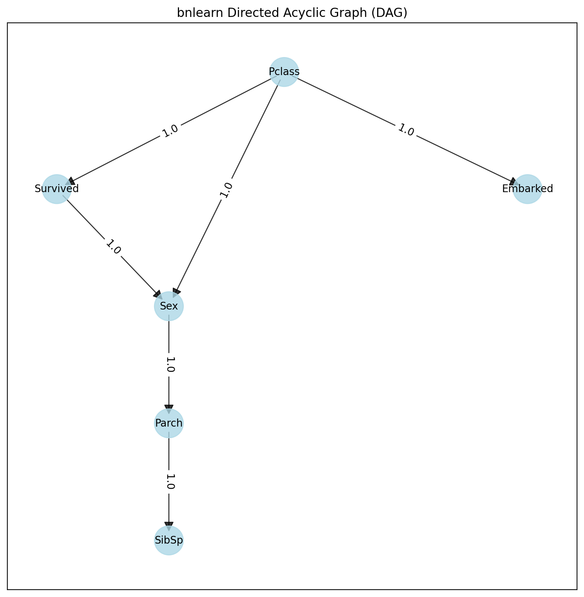

Examples
=================

``bnlearn`` contains several examples within the library that can be used to practice with the functionalities of :func:`bnlearn.structure_learning`, :func:`bnlearn.parameter_learning` and :func:`bnlearn.inference`.

Example with DataFrames
'''''''''''''''''''''''

In ``bnlearn``, there is one example dataset that can be imported; the **sprinkler** dataset. Note this dataset is readily one-hot, without missing values, and as such does not require any further pre-processing steps. The DAG example models (see Example DAG section) can however be converted from the model to a dataframe.

.. code-block:: python

   # Import dataset
   df = bnlearn.import_example()
   # Structure learning
   model = bnlearn.structure_learning.fit(df)
   # Plot
   G = bnlearn.plot(model)

Example with DAG
'''''''''''''''''

``bnlearn`` contains several example Directed Acyclic Graphs:
	* 'sprinkler' (default)
	* 'alarm'
	* 'andes'
	* 'asia'
	* 'pathfinder'
	* 'sachs'
	* 'miserables'

Each DAG can be loaded using the :func:`bnlearn.bnlearn.import_DAG` function. With the :func:`bnlearn.bnlearn.sampling` function a ``DataFrame`` can be created for *n* samples.
The sprinkler DAG is a special case because it is not loaded from a *bif* file but created manually. Therefore, the **sprinkler** model can be generated with(out) a CPD by: ``CPD=False``.

.. code-block:: python
   
   # Import dataset
   DAG = bnlearn.import_DAG('sachs', CPD=True)
   # plot the keys of the DAG
   DAG.keys()
   # dict_keys(['model', 'adjmat'])

   # The model contains the BayesianModel with the CPDs.
   # The adjmat contains the adjacency matrix with the relationships between the nodes.

   # plot ground truth
   G = bnlearn.plot(DAG)

   # Sampling
   df = bnlearn.sampling(DAG, n=1000)

Import from BIF
'''''''''''''''''''

Each Bayesian DAG model that is loaded with :func:`bnlearn.bnlearn.import_DAG` is derived from a *bif* file. The *bif* file is a common format for Bayesian networks that can be used for the exchange of knowledge and experimental results in the community. More information can be found (here)[http://www.cs.washington.edu/dm/vfml/appendixes/bif.htm].

.. code-block:: python
   
   # Import dataset
   DAG = bnlearn.import_DAG('filepath/to/model.bif')

Start with RAW data
'''''''''''''''''''

Lets demonstrate by example how to process your own dataset containing mixed variables. I will demonstrate this by the titanic case. This dataset contains both continues as well as categorical variables and can easily imported using :func:`bnlearn.bnlearn.import_example`.
With the function :func:`bnlearn.bnlearn.df2onehot` it can help to convert the mixed dataset towards a one-hot matrix. The settings are adjustable, but by default the unique non-zero values must be above 80% per variable, and the minimal number of samples must be at least 10 per variable.

.. code-block:: python

   # Load titanic dataset containing mixed variables
   df_raw = bnlearn.import_example(data='titanic')
   # Pre-processing of the input dataset
   dfhot, dfnum = bnlearn.df2onehot(df_raw)
   # Structure learning
   DAG = bnlearn.structure_learning.fit(dfnum)
   # Plot
   G = bnlearn.plot(DAG)

.. _fig-titanic:

From this point we can learn the parameters using the DAG and input dataframe.

.. code-block:: python

   # Parameter learning
   model = bnlearn.parameter_learning.fit(DAG, df)

Finally, we can start making inferences. Note that the variable and evidence names should exactly match the input data (case sensitive).

.. code-block:: python

   # Print CPDs
   bnlearn.print_CPD(model)
   # Make inference
   q = bnlearn.inference.fit(model, variables=['Survived'], evidence={'Sex':0, 'Pclass':1})
   
   print(q.values)
   print(q.variables)
   print(q._str())
   

+-------------+-----------------+
| Survived    |   phi(Survived) |
+=============+=================+
| Survived(0) |          0.3312 |
+-------------+-----------------+
| Survived(1) |          0.6688 |
+-------------+-----------------+
