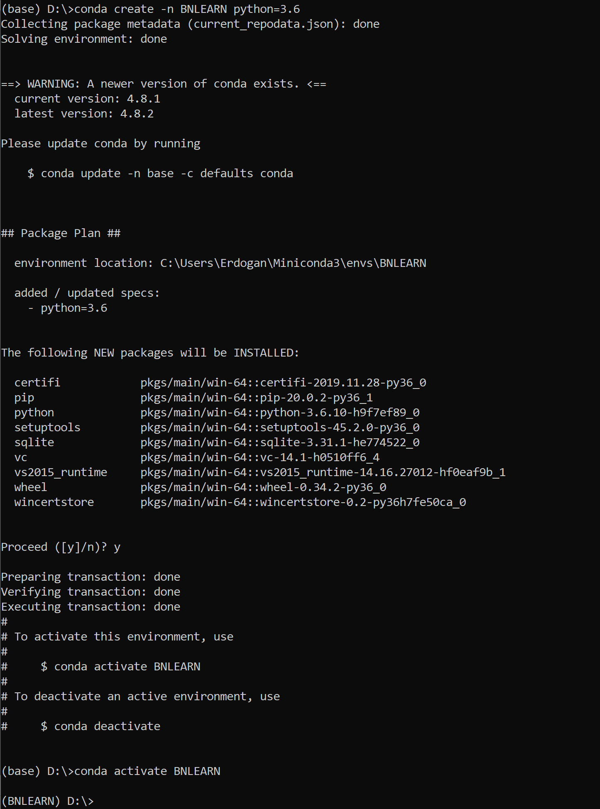
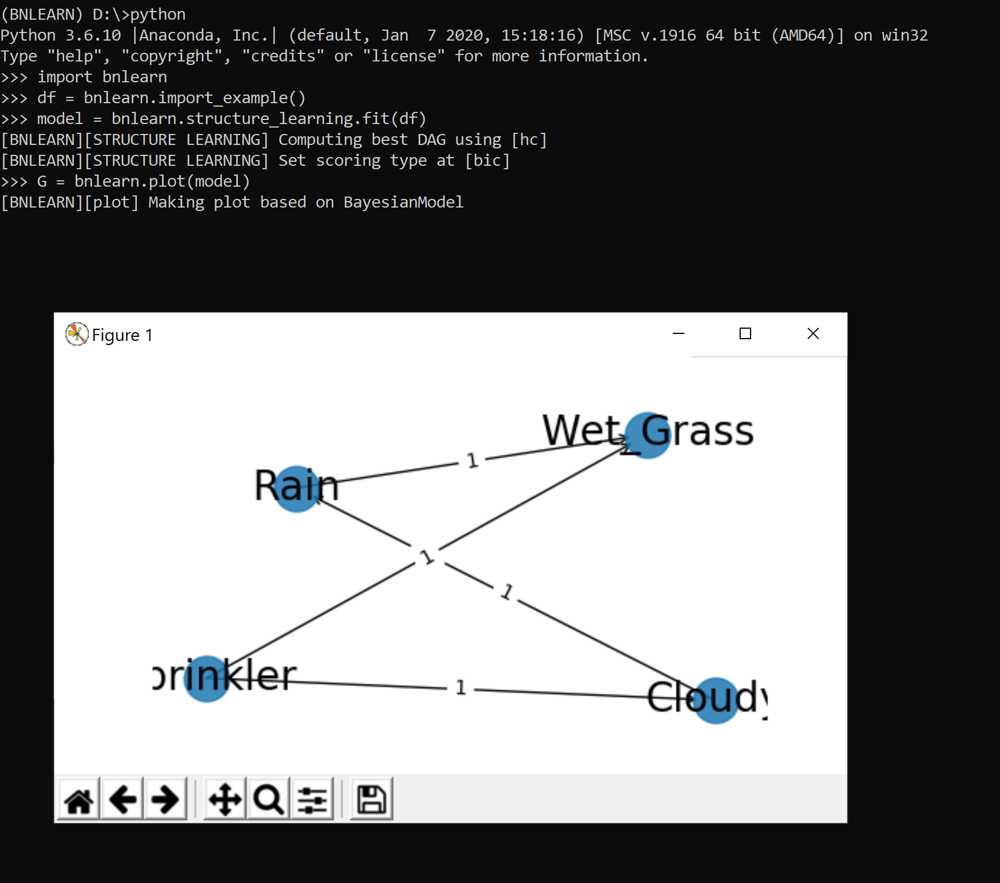

Installation
============

Install from PyPI (pip)
-----------------------

The simplest way to install bnlearn is using pip:

.. code-block:: console

    pip install bnlearn

To force install the latest version, use the -U (update) argument:

.. code-block:: console

    pip install -U bnlearn

Install with uv
---------------

If you use the `uv` helper for creating and managing virtual environments, you can install bnlearn using the following commands.

.. code-block:: console

    uv venv
    .venv\Scripts\activate
    uv pip install bnlearn

To install the package from the local source tree (editable install):

.. code-block:: console

    uv venv
    .venv\Scripts\activate
    git clone https://github.com/erdogant/bnlearn.git
    cd bnlearn
    uv pip install -U -e .

Install from GitHub
-------------------

To install the latest development version directly from GitHub:

.. code-block:: console

    pip install git+https://github.com/erdogant/bnlearn

Create Environment
------------------

For better dependency management, it's recommended to install ``bnlearn`` in an isolated Python environment using conda:

.. code-block:: console

    conda create -n env_bnlearn python=3.13
    conda activate env_bnlearn

.. _installation step 1:

   Create a new conda environment.

After activation, your command prompt should show the environment name. For example:

.. code-block:: console

   (env_bnlearn) D:\>

Uninstall
---------

To remove the ``bnlearn`` installation and its environment:

.. code-block:: console

   # List all active environments
   conda env list

   # Remove the bnlearn environment
   conda env remove --name env_bnlearn

   # Verify removal by listing environments again
   conda env list

Validate Installation
---------------------

To verify your installation, start Python in your console:

.. code-block:: console

   python

Then run the following code, which should generate a figure:

.. code-block:: python

   import bnlearn as bn
   df = bn.import_example()
   model = bn.structure_learning.fit(df)
   G = bn.plot(model)

.. _installation step 4:

Install SKILLS
-----------------------

The simplest way to install bnlearn skills in your working directory is:

.. code-block:: console

    bnlearn install skill

Change the harness with the -harness argument:
Default: claude but opencode agents or any other name is allowed.

.. code-block:: console

    bnlearn install skill --harness opencode
    bnlearn install skill --harness opencode --global
    bnlearn install skill --global

Troubleshooting Import Errors
-----------------------------

If you're using Jupyter Notebook or Google Colab, you might encounter a NumPy version compatibility error:

.. code-block:: python

    import bnlearn as bn
    # Error message:
    RuntimeError: module compiled against API version 0x10 but this version of numpy is 0xf
    ImportError: numpy.core.multiarray failed to import

This error occurs because ``bnlearn`` requires NumPy version 1.24.1 or higher. To resolve this:

1. To fix this, you need an installation of *numpy version=>1.24.1* which is installed during the ``bnlearn`` installation.
   However, when you are using colab or a jupyter notebook, you need to reset your kernel first to let it work.
2. If using Colab or Jupyter Notebook:
   - Go to the menu
   - Click **Runtime -> Restart runtime**
   - Re-import bnlearn

.. include:: add_bottom.add
