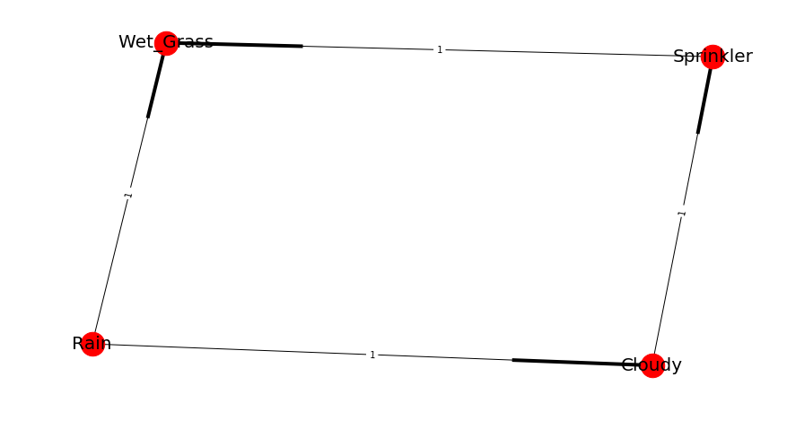

Parameter learning
===================

Parameter learning is the task to estimate the values of the conditional probability distributions (CPDs).
To make sense of the given data, we can start by counting how often each state of the variable occurs.
If the variable is dependent on the parents, the counts are done conditionally on the parents states,
i.e. for seperately for each parent configuration.

Currently, the library supports Parameter learning for *discrete* nodes:

  * Maximum Likelihood Estimation
  * Bayesian Estimation

Maximum Likelihood Estimation
======================================

A natural estimate for the CPDs is to simply use the *relative frequencies*, with which the variable states have occured. 

While very straightforward, the ML estimator has the problem of *overfitting* to the data.
If the observed data is not representative for the underlying distribution, ML estimations will be extremly far off.
When estimating parameters for Bayesian networks, lack of data is a frequent problem.
Even if the total sample size is very large, the fact that state counts are done conditionally for each parents configuration causes immense fragmentation.
If a variable has 3 parents that can each take 10 states, then state counts will be done seperately for `10^3 = 1000` parents configurations.
This makes MLE very fragile and unstable for learning Bayesian Network parameters.
A way to mitigate MLE's overfitting is *Bayesian Parameter Estimation*.

Bayesian Parameter Estimation
======================================

The Bayesian Parameter Estimator starts with already existing prior CPDs, that express our beliefs about the variables *before* the data was observed.
Those "priors" are then updated, using the state counts from the observed data.

One can think of the priors as consisting in *pseudo state counts*, that are added to the actual counts before normalization. Unless one wants to encode specific beliefs
about the distributions of the variables, one commonly chooses uniform priors, i.e. ones that deem all states equiprobable.

A very simple prior is the so-called *K2* prior, which simply adds "1" to the count of every single state.
A somewhat more sensible choice of prior is *BDeu* (Bayesian Dirichlet equivalent uniform prior).
For BDeu we need to specify an *equivalent sample size* "N" and then the pseudo-counts are the equivalent of having observed `N` uniform samples of each variable (and each parent configuration).

Examples Parameter learning
======================================

Example (1)
^^^^^^^^^^^^^^^^^^^^^^^^^^^^

For this example, we will be investigating the sprinkler data set. This is a very simple data set with 4 variables and each variable can contain value [1] or [0].
The question we can ask: What are the parameters for the DAG given a dataset? Note that his data set is already pre-processed and no missing values are present.
We need both a directed acycle graph (DAG) and dataset with the same variables. The idea is to link the dataset with the DAG.

Let's bring in our dataset. 

.. code-block:: python

  import bnlearn
  df = bnlearn.import_example()
  df.head()

.. table::

  +--------+-----------+------+-------------+
  |Cloudy  | Sprinkler | Rain |  Wet_Grass  |
  +========+===========+======+=============+
  |    0   |      1    |  0   |      1      |
  +--------+-----------+------+-------------+
  |    1   |      1    |  1   |      1      |
  +--------+-----------+------+-------------+
  |    1   |      0    |  1   |      1      |
  +--------+-----------+------+-------------+
  |    ... |      ...  | ...  |     ...     |
  +--------+-----------+------+-------------+
  |    0   |      0    |  0   |      0      |
  +--------+-----------+------+-------------+
  |    1   |      0    |  0   |      0      |
  +--------+-----------+------+-------------+
  |    1   |      0    |  1   |      1      |
  +--------+-----------+------+-------------+

.. code-block:: python

  DAG = bnlearn.import_DAG('sprinkler', CPD=False)
  print(DAG)

.. table::
  
  +-----------+--------+-----------+-------+-----------+
  |           | Cloudy | Sprinkler | Rain  | Wet_Grass |
  +===========+========+===========+=======+===========+
  | Cloudy    | False  | True      | True  | False     |
  +-----------+--------+-----------+-------+-----------+
  | Sprinkler | False  | False     | False | True      |
  +-----------+--------+-----------+-------+-----------+
  | Rain      | False  | False     | False | True      |
  +-----------+--------+-----------+-------+-----------+
  | Wet_Grass | False  | False     | False | False     |
  +-----------+--------+-----------+-------+-----------+

.. code-block:: python

  bnlearn.plot(DAG)

.. _fig-pl:

  DAG of the prinkler data set.

Suppose we observed **N** "cloudy" occurences among a total of "all clouds", so we might guess that about "50%" of "cloudy" are "sprinkler" or so.
According to MLE, we should fill the CPDs in such a way, that P(data|model) is maximal. This is achieved when using the *relative frequencies*.
From the *bnlearn* library, we'll need the :class:`~bnlearn.parameter_learning.fit` for this exercise:

.. code-block:: python

   DAG_update = bnlearn.parameter_learning.fit(DAG, df)

CPD of Cloudy:
  +-----------+-------+
  | Cloudy(0) | 0.494 |
  +===========+=======+
  | Cloudy(1) | 0.506 |
  +-----------+-------+

CPD of Sprinkler:
  +--------------+-------------+----------+
  | Cloudy       | Cloudy(0)   | Cloudy(1)|
  +==============+=============+==========+
  | Sprinkler(0) | 0.48        | 0.70     |
  +--------------+-------------+----------+
  | Sprinkler(1) | 0.51        | 0.29     |
  +--------------+-------------+----------+

CPD of Rain:
  +---------+-----------+-----------+
  | Cloudy  | Cloudy(0) | Cloudy(1) |
  +=========+===========+===========+
  | Rain(0) | 0.65      | 0.33      |
  +---------+-----------+-----------+
  | Rain(1) | 0.34      | 0.66      |
  +---------+-----------+-----------+

CPD of Wet_Grass:
  +--------------+--------------+--------------+--------------+--------------+
  | Rain         | Rain(0)      | Rain(0)      | Rain(1)      | Rain(1)      |
  +==============+==============+==============+==============+==============+
  | Sprinkler    | Sprinkler(0) | Sprinkler(1) | Sprinkler(0) | Sprinkler(1) |
  +--------------+--------------+--------------+--------------+--------------+
  | Wet_Grass(0) | 0.75         | 0.33         | 0.25         | 0.37         |
  +--------------+--------------+--------------+--------------+--------------+
  | Wet_Grass(1) | 0.24         | 0.66         | 0.74         | 0.62         |
  +--------------+--------------+--------------+--------------+--------------+

Great! We have the probabilities! Lets check how much they differ from the truth.
In general it can be seen that the estimated values are not very close at every point to the true values.
The main reason is because the dataframe only contains 1000 samples.

.. code-block:: python

  DAG_true = bnlearn.import_DAG('sprinkler', CPD=True)

CPD of Cloudy:
  +-----------+-----+
  | Cloudy(0) | 0.5 |
  +-----------+-----+
  | Cloudy(1) | 0.5 |
  +-----------+-----+

CPD of Sprinkler:
  +--------------+-----------+-----------+
  | Cloudy       | Cloudy(0) | Cloudy(1) |
  +--------------+-----------+-----------+
  | Sprinkler(0) | 0.5       | 0.9       |
  +--------------+-----------+-----------+
  | Sprinkler(1) | 0.5       | 0.1       |
  +--------------+-----------+-----------+

CPD of Rain:
  +---------+-----------+-----------+
  | Cloudy  | Cloudy(0) | Cloudy(1) |
  +---------+-----------+-----------+
  | Rain(0) | 0.8       | 0.2       |
  +---------+-----------+-----------+
  | Rain(1) | 0.2       | 0.8       |
  +---------+-----------+-----------+

CPD of Wet_Grass:
  +--------------+--------------+--------------+--------------+--------------+
  | Sprinkler    | Sprinkler(0) | Sprinkler(0) | Sprinkler(1) | Sprinkler(1) |
  +--------------+--------------+--------------+--------------+--------------+
  | Rain         | Rain(0)      | Rain(1)      | Rain(0)      | Rain(1)      |
  +--------------+--------------+--------------+--------------+--------------+
  | Wet_Grass(0) | 1.0          | 0.1          | 0.1          | 0.01         |
  +--------------+--------------+--------------+--------------+--------------+
  | Wet_Grass(1) | 0.0          | 0.9          | 0.9          | 0.99         |
  +--------------+--------------+--------------+--------------+--------------+

Lets generate more samples and learn again the parameters. You will see that these results are much closer to the true values.

.. code-block:: python

  df = bnlearn.sampling(DAG, n=10000)
  DAG_update = bnlearn.parameter_learning.fit(DAG, df)

Example (2)
^^^^^^^^^^^^^^^^^^^^^^^^^^^^

Lets try out a more complexer model. We need both a directed acycle graph (DAG) and dataset with the same variables. 
So again, the idea is to link the dataset with the DAG.

Let's bring in the **asia** dataset. 

.. code-block:: python

  import bnlearn

  # Load asia data set
  DAG = bnlearn.import_DAG('asia')
  # Plot
  G = bnlearn.plot(DAG)

.. figure:: ../figs/fig2a_asia_groundtruth.png

  DAG of the Asia data set.

.. code-block:: python

  # Generate samples
  df = bnlearn.sampling(DAG, n=10000)

  # Learn parameters
  DAG_update = bnlearn.parameter_learning.fit(DAG, df)

This DAG is now updated with parameters which is great because it opens many possibilities in terms of inference or you can start sampling any number of samples you desire.

CPD of asia:
  +---------+-------+
  | asia(0) | 0.055 |
  +---------+-------+
  | asia(1) | 0.944 |
  +---------+-------+
CPD of bronc:
  +----------+----------+----------+
  | smoke    | smoke(0) | smoke(1) |
  +----------+----------+----------+
  | bronc(0) | 0.585    | 0.319    |
  +----------+----------+----------+
  | bronc(1) | 0.414    | 0.680    |
  +----------+----------+----------+
CPD of dysp:
  +---------+-----------+-----------+-----------+-----------+
  | bronc   | bronc(0)  | bronc(0)  | bronc(1)  | bronc(1)  |
  +---------+-----------+-----------+-----------+-----------+
  | either  | either(0) | either(1) | either(0) | either(1) |
  +---------+-----------+-----------+-----------+-----------+
  | dysp(0) | 0.714     | 0.787     | 0.586     | 0.123     |
  +---------+-----------+-----------+-----------+-----------+
  | dysp(1) | 0.285     | 0.212     | 0.413     | 0.876     |
  +---------+-----------+-----------+-----------+-----------+
CPD of either:
  +-----------+---------+---------+---------+---------+
  | lung      | lung(0) | lung(0) | lung(1) | lung(1) |
  +-----------+---------+---------+---------+---------+
  | tub       | tub(0)  | tub(1)  | tub(0)  | tub(1)  |
  +-----------+---------+---------+---------+---------+
  | either(0) | 0.507   | 0.837   | 0.642   | 0.012   |
  +-----------+---------+---------+---------+---------+
  | either(1) | 0.492   | 0.1625  | 0.357   | 0.987   |
  +-----------+---------+---------+---------+---------+
CPD of lung:
  +---------+----------+----------+
  | smoke   | smoke(0) | smoke(1) |
  +---------+----------+----------+
  | lung(0) | 0.132    | 0.0537   |
  +---------+----------+----------+
  | lung(1) | 0.867    | 0.9462   |
  +---------+----------+----------+
CPD of smoke:
  +----------+-------+
  | smoke(0) | 0.498 |
  +----------+-------+
  | smoke(1) | 0.501 |
  +----------+-------+
CPD of tub:
  +--------+---------+---------+
  | asia   | asia(0) | asia(1) |
  +--------+---------+---------+
  | tub(0) | 0.418   | 0.0336  |
  +--------+---------+---------+
  | tub(1) | 0.581   | 0.9663  |
  +--------+---------+---------+
CPD of xray:
  +---------+-----------+-----------+
  | either  | either(0) | either(1) |
  +---------+-----------+-----------+
  | xray(0) | 0.7693    | 0.070     |
  +---------+-----------+-----------+
  | xray(1) | 0.230     | 0.929     |
  +---------+-----------+-----------+

