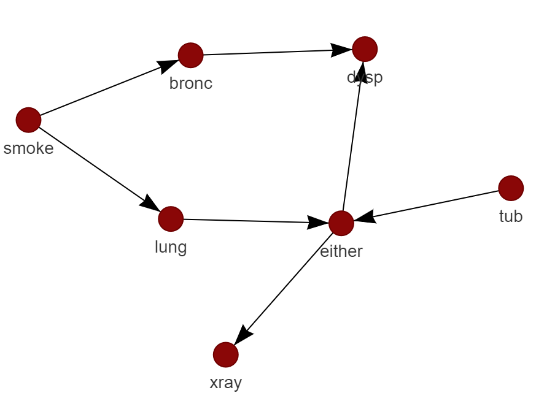
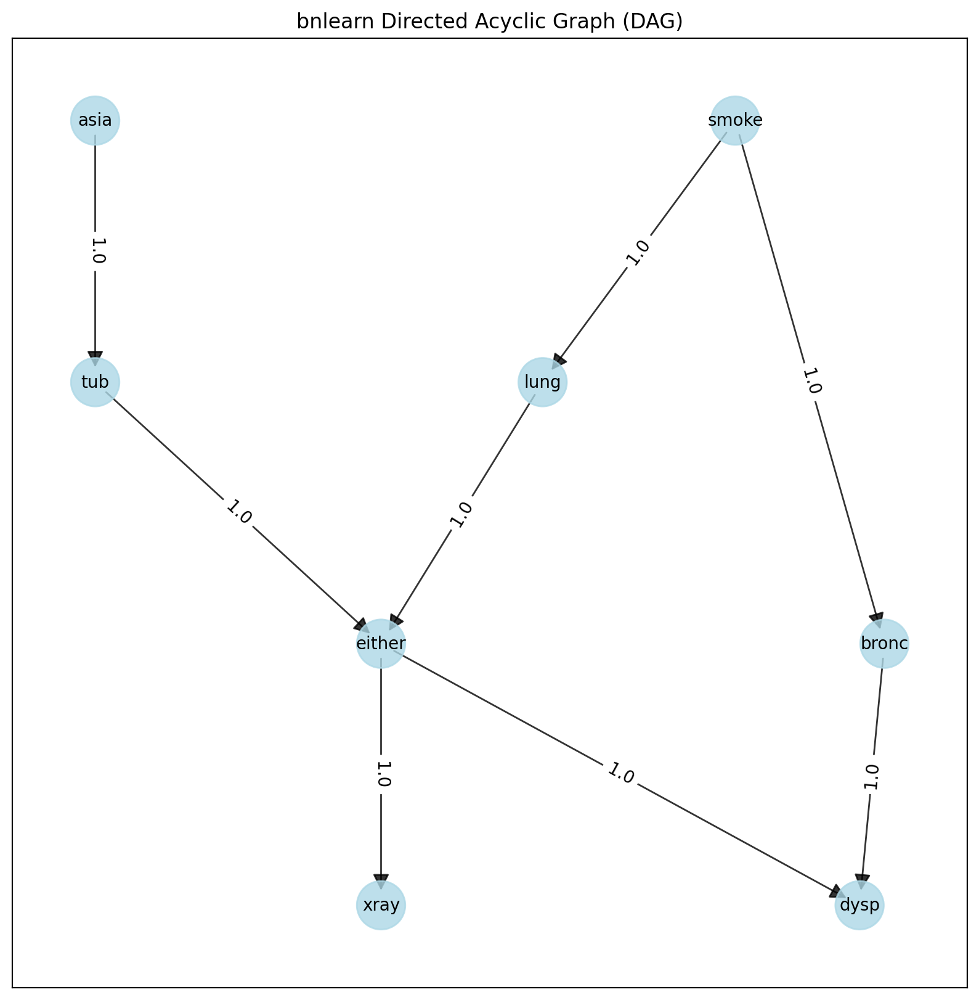
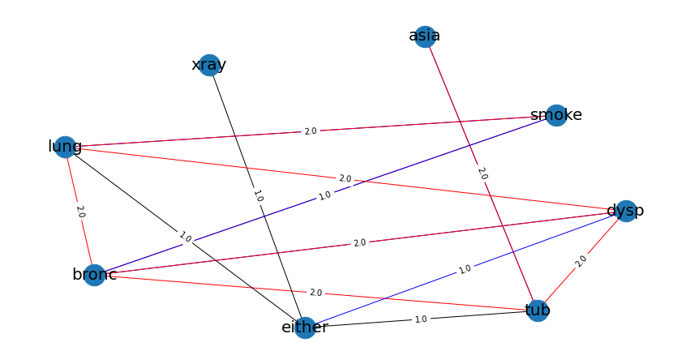
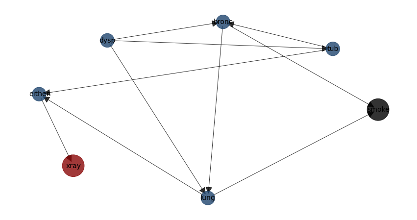

Interactive plot
=================

``bnlearn`` contains **interactive** and **static** plotting functionalities with :func:`bnlearn.bnlearn.plot` for which many network and figure properties can be adjusted, such as node colors and sizes. 
To make interactive plots, it simply needs to set the ``interactive=True`` parameter in :func:`bnlearn.bnlearn.plot`. 
The interactive plots are created using the ``D3Blocks`` library for which various input parameters can be specified. The static plots are created using matplotlib and networkx.
Lets make some interactive and static examples. 

**Interactive plot examples**

.. code-block:: bash

	# Install the d3blocks library first if you want interactive plots
	pip install d3blocks

.. code-block:: python
    
	# Example of interactive plotting
	import bnlearn as bn

	# Load example dataset
	df = bn.import_example(data='asia')

	# Structure learning
	model = bn.structure_learning.fit(df)

	# Make interactive plot with default settings
	bn.plot(model, interactive=True)

	# Add more parameters for the interactive plot
	bn.plot(model, interactive=True, params_interactive = {'height':'800px', 'width':'70%', 'layout':None, 'bgcolor':'#0f0f0f0f'})

.. raw:: html

   <iframe src="https://erdogant.github.io/docs/pyvis/bnlearn_asia_causal_network.html" height="1300px" width="800px", frameBorder="0"></iframe>

**Create interactive plots with a specific node-color and node-sizes across the entire network.**

Note that all the results below can be interactive as the graph above. But for demonstration purposes I created a screenshot.

.. code-block:: python

   # Set the node color
   bn.plot(model, interactive=True, node_color='#8A0707')
   # Set the node color and node size
   bn.plot(model, interactive=True, node_color='#8A0707', node_size=25)

.. |figIP2| image:: ../figs/_fig-plot_interactive_simple_color_size.png

.. table:: Plot with node-colors
   :align: center

   +----------+----------+
   | |figIP1| | |figIP2| |
   +----------+----------+

**Create interactive plots with user-defined node-colors and node-sizes.**

.. code-block:: python

    # First retrieve node properties
    node_properties = bn.get_node_properties(model)

    # Make some changes
    node_properties['xray']['node_color']='#8A0707'
    node_properties['xray']['node_size']=50
    node_properties['smoke']['node_color']='#000000'
    node_properties['smoke']['node_size']=35

    # Make plot with the specified node properties
    bn.plot(model, node_properties=node_properties, interactive=True)

.. |figIP3| image:: ../figs/_fig-plot_interactive_user_colors.png

.. table:: Plot with user defined node colors and node sizes.
   :align: center

   +----------+
   | |figIP3| |
   +----------+

**The ``params_interactive`` parameter allows you to adjust more figure properties.**

.. code-block:: python

    bn.plot(model, interactive=True, params_interactive = {'height':'800px', 'width':'70%', 'layout':None, 'bgcolor':'#0f0f0f0f'})

Static plot
=================

To create static plots simply set the ``interactive=False`` in all the above examples. The only difference is in ``params_static`` for which the dict contains more variables that adjust the figure properties.

.. code-block:: python

    # Add parameters for the static plot
    bn.plot(model, interactive=False, params_static = {'width':15, 'height':8, 'font_size':14, 'font_family':'times new roman', 'alpha':0.8, 'node_shape':'o', 'facecolor':'white', 'font_color':'#000000'})

Comparison of two networks
==================================

In come cases you may derive two networks where you need to know the differences. In the following example I will learn a network using structure learning and compare it to the ground truth.

.. code-block:: python

	# Load asia DAG
	model = bn.import_DAG('asia')

	# plot ground truth
	G = bn.plot(model)
	
	# Sampling
	df = bn.sampling(model, n=10000)
	
	# Structure learning of sampled dataset
	model_sl = bn.structure_learning.fit(df, methodtype='hc', scoretype='bic')
	
	# Compute edge strength with the chi_square test statistic
	model_sl = bn.independence_test(model_sl, df, test='chi_square', prune=True)
	
	# Plot based on structure learning of sampled data
	bn.plot(model_sl, pos=G['pos'])
	
	# Compare networks and make plot
	bn.compare_networks(model, model_sl, pos=G['pos'])

.. |fig_cn2| image:: ../figs/fig2b_asia_structurelearning.png

.. table:: Asia ground truth network versus the learned network.
   :align: center

   +----------+
   | |fig_cn1||
   +----------+
   | |fig_cn2||
   +----------+

.. |fig_cn4| image:: ../figs/fig2d_confmatrix.png

.. table:: Differences in het edges.
   :align: center

   +----------+----------+
   | |fig_cn3|| |fig_cn4||
   +----------+----------+

Node properties
=================

Edge properties can easily be changed using the :func:`bnlearn.bnlearn.get_node_properties` function.
Note that these functionalities can be combined with the edge properties.

.. code-block:: python

    import bnlearn as bn
    # Load asia DAG
    df = bn.import_example(data='asia')
    # Structure learning of sampled dataset
    model = bn.structure_learning.fit(df)
    # plot static
    G = bn.plot(model)
    
    # Set node properties
    node_properties = bn.get_node_properties(model)

    # Make some changes
    node_properties['xray']['node_color']='#8A0707'
    node_properties['xray']['node_size']=2000
    node_properties['smoke']['node_color']='#000000'
    node_properties['smoke']['node_size']=2000

    # Make plot with the specified node properties
    bn.plot(model, node_properties=node_properties, interactive=False)

.. table:: Plot with user defined node properties.
   :align: center

   +----------+
   | |figIP4| |
   +----------+

Edge properties
=================

Edge properties can easily be changed using the :func:`bnlearn.bnlearn.get_edge_properties` function.
Note that these functionalities can be combined with the node properties.

.. code-block:: python

    import bnlearn as bn
    # Load asia DAG
    df = bn.import_example(data='asia')
    # Structure learning of sampled dataset
    model = bn.structure_learning.fit(df)
    # Test for significance
    model = bn.independence_test(model, df)
    # plot static
    G = bn.plot(model)

    # Set some edge properties
    # Because the independence_test is used, the -log10(pvalues) from model['independence_test']['p_value'] are scaled between minscale=1 and maxscale=10
    edge_properties = bn.get_edge_properties(model)

    # Make some changes
    edge_properties['either', 'xray']['color']='#8A0707'
    edge_properties['either', 'xray']['weight']=4
    edge_properties['bronc', 'smoke']['weight']=15
    edge_properties['bronc', 'smoke']['color']='#8A0707'
    
    # Plot
    params_static={'edge_alpha':0.6, 'arrowstyle':'->', 'arrowsize':60}
    bn.plot(model, interactive=False, edge_properties=edge_properties, params_static=params_static)

.. |figIP5| image:: ../figs/edge_properties_1.png

.. table:: Plot with user defined edge properties.
   :align: center

   +----------+
   | |figIP5| |
   +----------+

.. include:: add_bottom.add